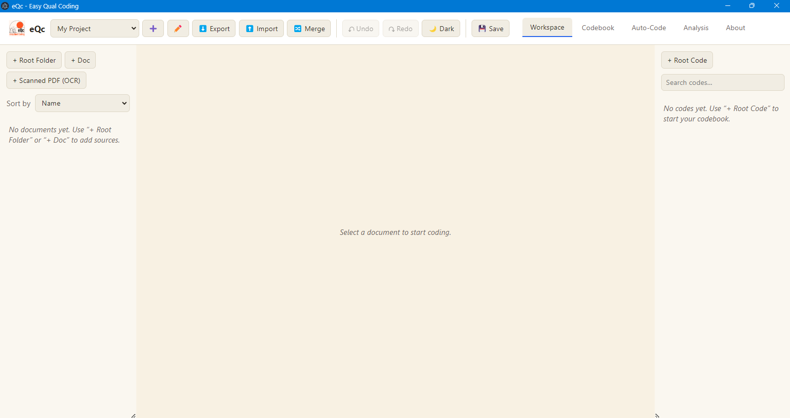
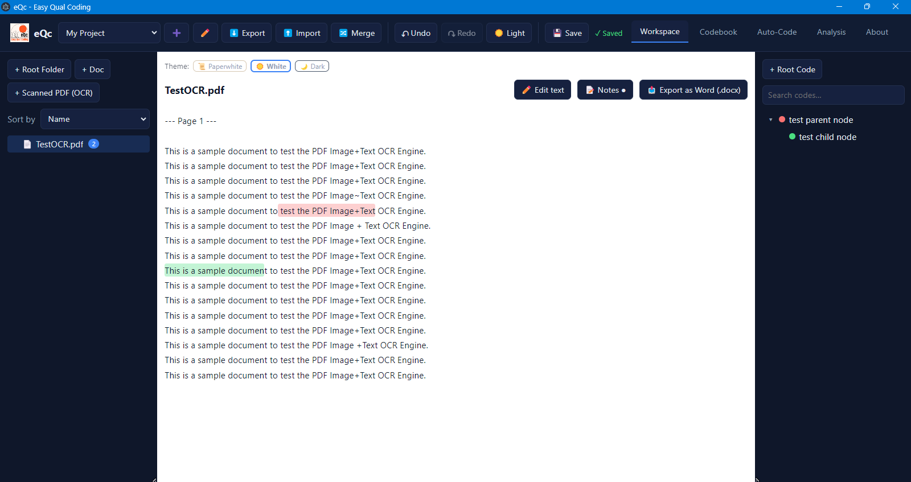
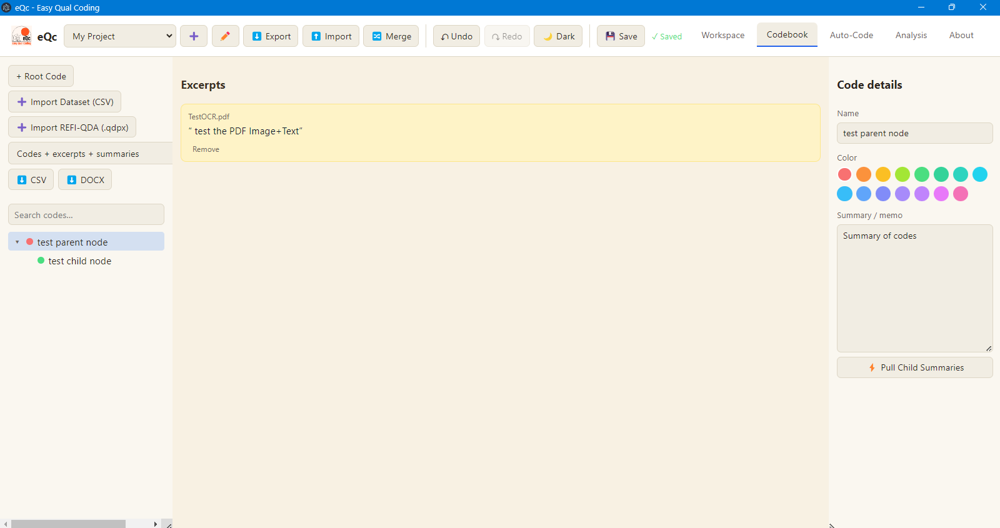
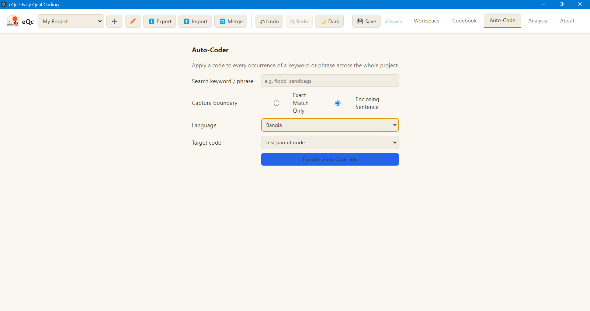
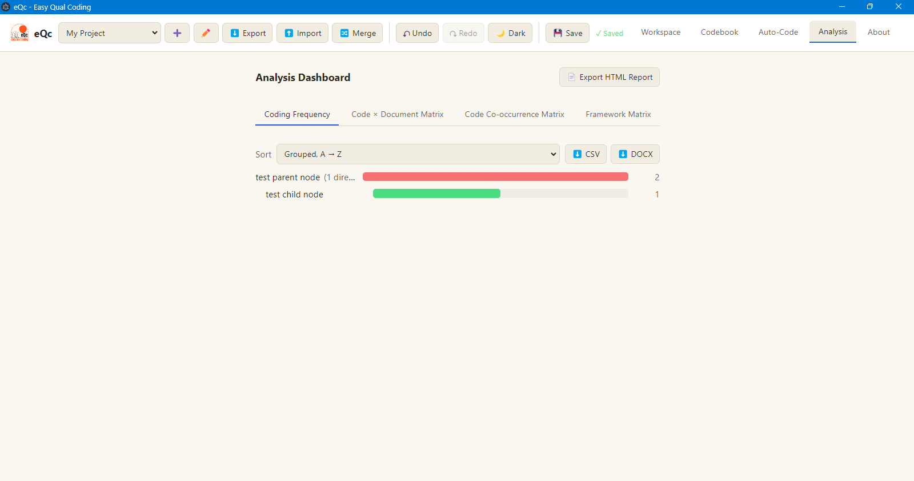
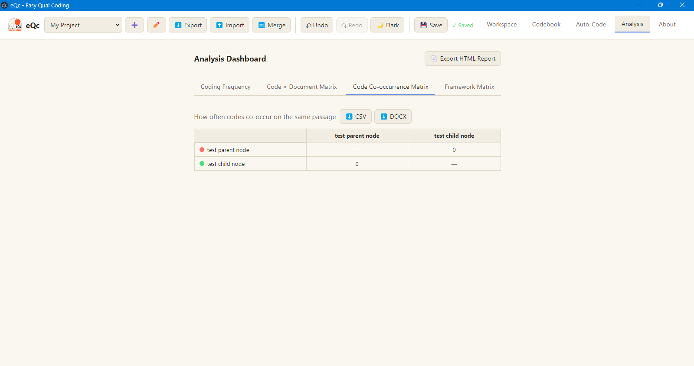
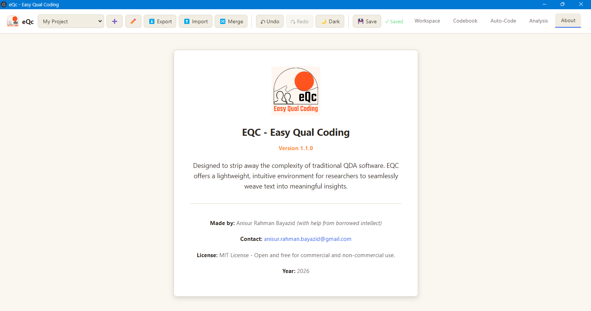

# eQc — Easy Qual Coding

## Complete User Guide & Documentation (v1.5.6)

eQc is a lightweight, **local-first** qualitative data analysis (QDA) desktop application built with Electron, React, and SQLite. All project data — documents, codes, memos, matrices — is stored **locally on your device**. Nothing leaves your computer (except, optionally, the project backups you choose to export or share).

---

## What's New in v1.5.6

- **🗺️ Code Map is now a real canvas** — choose the canvas size (**Map, A5, A4, Letter, Legal**, or a fully **Custom** W×H) and zoom from **10–400%**. The map is rendered as a paper with true pixel dimensions; zooming in scrolls the viewport instead of stretching the drawing. Changing size instantly rescales every node to fit the new bounds, so nothing is ever cropped off the paper.
- **🎨 Style the map** — right-click any node to switch shape (**circle / square / diamond**); click any edge to set **solid/dashed/dotted**, straight or **curved**, **arrowheads**, **colors**, and **labels**. Styled and custom edges persist with the project. “**✏️ Draw edge**” connects any two nodes, and co-occurrence edges (codes that share documents) can be shown or hidden.
- **📊 Vertical coding strip** — the Document Portrait is now a minimap running down the right edge of the document. **Click any colored band to jump straight to that passage** in the text; bands **widen on hover** so even one-line codings are easy to click.
- **🔍 Code while you search** — select a passage in the document, click the code search box and type: the selection stays put, and a **click (or a drag) on any search result applies that code** to the selected text. You can also drag a code from the legend straight onto the document.
- **↕️ Drag-reorder the code legend** — drag codes onto each other to **reorder** siblings, **reparent**, or drop them into empty space to move to root; the order is remembered.
- **🧹 Clean redundant codings** — merges overlapping double-codings of the same code in the same document into one clean passage, so counts are never inflated.
- **🎨 60 more code colors** — a “🎨 More colors…” palette joins the Codebook's swatches.
- **⬇️ Codebook-only REFI-QDA export** — export just the code tree (hierarchy, colors, memos) as a compact `.qdpx` archive for sharing the codebook itself.
- **🖼️ Drag images between folders** in the document tree.
- **📁 Safer folder deletion** — deleting a folder moves its documents to the project root rather than deleting them.

---

## What's New in v1.5.5

- **🧹 Clean up duplicate coder names** — Project Settings now has a **“Manage Coders (Cleanup)”** section listing every coder that has coded items, with their segment/region counts and a 🗑️ button. Deleting asks you to **type the exact coder name**, so a typos (like `bayazid-dev` instead of `bayazid_dev`) that duplicated your work can be safely erased in one shot — nothing is ever removed by accident. (Untagged **Unattributed** items are shielded and can't be bulk-deleted this way.)
- **🔘 Tidy header buttons** — Undo, Redo, and Save are now compact icon-only buttons (label in the tooltip).
- **🌗 Dark-mode fix** — the Codebook “Sort by” dropdown (and a couple of other controls) were nearly invisible in dark mode; they now follow the light/dark theme correctly.
- **📏 Cleaner settings modal** — Project Settings scrolls on shorter screens so all controls stay reachable.

---

## What's New in v1.5.4

- **🧭 Multitask freely during LAN sessions** — you can now open, view, and edit **any** local project while a live session runs in the background. Only the session-shared project syncs over the network; everything else stays local and private.
- **🟢 / ⚪ Quiet status chip** — the old alarm-style “project mismatch” banner is gone. A small chip next to the 🌐 LAN button now just tells you what's happening: **🟢 Synced** when you're on the shared project, or **⚪ Local only (not synced)** when you're on another one. The shared project also gets a 🟢 dot in the project dropdown so it's always easy to find.
- **📦 Background syncing** — while you work on another project, incoming edits from teammates are saved silently to the database **without switching your screen**, and are never mistaken for “offline edits” later.
- **🚪 Kick a member (host)** — each connected coder's chip in the LAN panel now has an ✕ button so you can disconnect that specific person; they see a clear “You were disconnected by the host” message.
- **🛠️ Manage your other projects freely** — LAN clients can rename/delete their own non-shared projects during a session; only the session-shared project stays locked.
- **🔒 Hard project-lock fix** — sessions are now locked to exactly one project id at every layer, fixing a bug where switching to a different local project mid-session could leak its edits into the session or mix up saved data.

---

## What's New in v1.5.3

- **👥 Coder attribution** — every coded passage and image region records **who coded it** (manual, auto-code, or merged). Names are stamped at the moment the item is created and are **never changed later**.
- **🎛️ Filter by coder** — new **Coder** dropdowns in the Workspace (doc tree panel) and Codebook (Excerpts header) let you view only one coder's work, or **Everyone**. Scan adds an **Unattributed** group so nothing is hidden.
- **🧍 Coder-name disentanglement** — when one PC is shared by several coders, changing the Coder Name in Project Settings only affects codes made *afterward*; earlier codes keep their original attribution. Older/imported items with no stamp show as **Unattributed**, and you can assign them in one click via **Project Settings → “Assign N Unattributed item(s) to this coder.”**
- **📤 Coder column in exports** — scoped CSV/DOCX exports and Starred Quotes include a **Coder** column (per-segment stamp, or "Unattributed").
- **🟢 Live presence (LAN)** — in a shared session, the document tree shows colored dots next to documents/images that teammates are currently viewing, with a "Viewing: …" tooltip; the host is notified with a toast when someone joins.
- **🔎 Clearer "Coded by" everywhere** — described tags now appear on text excerpts, image-region cards, and in both click-popups in the workspace.

---

## What's New in v1.5.2

- **🧠 Smarter auto-coding** — the Auto-Coder now has two matching modes: **Literal** (exact substring, e.g. `tree` also finds it inside `street`) and **Word roots & variants** (`green` → `greens`, `greenery`; `tree` → `trees`). Root mode is word-boundary aware, so `tree` no longer fires inside `street`/`treehouse`.
- **⚡ Live match preview** — before you execute, the Auto-Coder shows exactly how many **new** passages it would code across how many documents (debounced while you type), so you can tune the query before committing.
- **🌐 LAN client fixes** — joining a session now correctly shows you as the *client* (with the **Disconnect** button) instead of a phantom host, and the connection panel opens on the right tab and names the actual host.
- **📝 Smoother codebook editing** — typing in the code **name** / **summary** fields no longer saves-and-re-renders the whole app on every keystroke; it debounces and commits on blur/Enter.
- **⚡ Performance** — document/index tree badges, codebook excerpt lookups, and code-tree sorting are precomputed maps instead of per-row scans.
- **🐛 Fixes** — LAN presence re-broadcast reliability, and various small stability refinements.

---

## What's New in v1.5.0

Since the previous guide, eQc has grown these major capabilities:

- **🌐 LAN Collaboration** — host a live, password-protected coding session on your local network and sync edits, coding, and image-coding in real time between several computers (or two eQc windows on one PC).
- **🖼️ Image sources & image coding** — add images to your project, draw *coded regions* on them, rename them, zoom, see how many regions each image has, and export starred regions.
- **⬇️ REFI-QDA (.qdpx) export** — export the whole project (codebook, text sources, coded passages, images and their coded regions) so NVivo / MAXQDA / ATLAS.ti can open it. `.qdpx` **image import** now also brings images and their coded regions in.
- **📄 DOCX comment import** — import codes and passages written as **Word comments**, including spreadsheet-style separator and speaker-echo options.
- **🔤 Reader font controls** — change the reading font family and size (`A−` / `A+`, 8–48 px) in the header; settings are remembered on each machine.
- **🎨 Code colors** — new root codes get a palette color, subcodes automatically inherit their parent's color (still overridable), and merge assigns each coder a stable, distinct color.
- **🔍 Search text inside documents** directly from the Workspace panel.
- Tighter analysis exports (each dashboard view exports what's on screen) and a cleaner Codebook export layout.

---

## Table of Contents

1. [Overview & Architecture](#1-overview--architecture)
2. [Header Bar & Project Management](#2-header-bar--project-management)
3. [The Workspace Tab (Document Editor & Manual Coding)](#3-the-workspace-tab)
4. [The Codebook Manager (Codebook Tab)](#4-the-codebook-manager)
5. [The Auto-Coder Tab](#5-the-auto-coder-tab)
6. [The Analysis Dashboard Tab](#6-the-analysis-dashboard-tab)
7. [LAN Collaboration](#7-lan-collaboration)
8. [The About Tab](#8-the-about-tab)
9. [Summary Table of Supported File Types](#9-summary-table-of-supported-file-types)

---

## 1. Overview & Architecture

### Key highlights

- **Local-first & secure** — everything lives in a local SQLite database on your machine.
- **Dual theme** — Light "paperwhite" mode (default for new installs) and Dark mode, toggled from the header.
- **Flexible workspace** — resizable, draggable panels throughout.
- **Multiformat support** — `.txt`, `.docx`, `.pdf`, scanned PDFs (via local OCR), **images** (`.png`, `.jpg/.jpeg`, `.gif`, `.webp`, `.bmp`), structured `.csv` datasets, Word comment files, and REFI-QDA `.qdpx` projects (NVivo, MAXQDA, ATLAS.ti, Taguette) — in **both** directions (import **and** export).
- **Live collaboration** — host or join a LAN coding session (see [Section 7](#7-lan-collaboration)).
- **Branded loading screen** shown while a project is opening.

---

## 2. Header Bar & Project Management

The header has two rows: the top row holds the **brand and the main tabs** (Workspace · Codebook · Auto-Code · Analysis · About); the bottom row holds **project controls**, the **LAN button**, **Undo/Redo**, reading **font controls**, the **theme toggle**, and **Save**.

### 2.1 Project operations

- **➕ New project** — create a fresh local project.
- **✏️ Rename project** — opens the project settings dialog (also where deletion lives).
- **⬇️ Export / ⬆️ Import** (`.json`) — full project backup and restore (documents, codes, highlights, memos, relationships).
- **🔀 Merge** — combine another project's `.json` into the active one (useful for multi-coder collaboration). When merging, each coder is assigned a stable, distinct color.
- **Project dropdown** — switch between projects; the header save indicator shows auto-save status (`✓ Saved` / `Saving…` / `⚠ Save failed`).

### 2.2 LAN collaboration

The **`🌐 LAN`** button opens the collaboration window. After the corresponding session state is active (`·Hosting` or `·Joined`), the button lights up green. See [Section 7](#7-lan-collaboration) for the full workflow.

### 2.3 Undo / Redo

Reverts coding, code-tree, memo, image-coding, and note changes (`Ctrl+Z`, `Ctrl+Shift+Z`).

### 2.4 Reader font controls

Next to Undo/Redo: a **font-family** picker (Georgia, Times New Roman, Arial, Verdana, Calibri, Courier New, or the default) and **`A−` / `A+`** size buttons (8–48 px, shown as `Npx`). These only change how you *read* documents; they persist per machine in `localStorage`.

### 2.5 Deleting a project

There is **no separate delete icon** — it's tucked inside the rename dialog on purpose, so it isn't one accidental click away. Click **✏️** next to the project name, then **"🗑 Delete this project…"** at the bottom of that dialog. Deletion requires two confirmations in a row ("Are you sure?" → "This cannot be reverted") before anything happens, and the safe option (No / Keep) is always the green button.

---

## 3. The Workspace Tab

### 3.1 Documents panel (left)

- **Folders** — `+ Add Root Folder` / `+ Doc` / `+ Scanned PDF (OCR)` / `+ Add Image`. Nested folders are supported.
- **Document types** — `.txt`, `.docx`, `.pdf`, and image PDFs turned into selectable text via local OCR.
- **Images** — added with `+ Add Image` and shown inside the tree, with a **coded-region count badge** on each image row and a **✏️ rename** button.
- **Sort documents** — by name, date added, size, or amount coded.
- **🔍 Search Text** — search inside the content of all documents at once; click a result to jump to that passage.
- A **document name filter** narrows the tree as you type.

### 3.2 Document editor (center)

- Select text and apply codes by **drag-and-drop** onto a code in the legend, or by **clicking a code** while the passage is selected.
- **Overlapping and nested coding** is supported: select a sub-portion of already-coded text and apply a different code to just that inner piece. Both codes render, with a *solid* underline marking multi-coded text. Clicking a highlighted passage shows **every** code applied there.
- Click a highlighted passage to open the **code inspector**, where you can:
  - **Remove** a code from that passage.
  - **Star / Unstar** it as a key quote for manuscript writing.
  - Add or edit a short **note** on that specific coded excerpt.
- **📝 Notes** (next to "Edit text") — a document-level memo field for whole-case interpretation or observations that apply to the transcript as a whole. A filled-in note shows a bullet marker on the button.

### 3.3 Image coding

Images behave like a unit of "text": open an image and use the **image editor** to draw a rectangle over a region, then apply a code to it. The editor provides zoom controls (`−` / `+`, a 10%-step slider, and Reset). Coded regions appear in the codebook's collated excerpts and count toward the analysis dashboard; **starred regions** can be exported together with a screenshot (see [Section 4.4](#44-export-options-codebook)).

### 3.4 Code legend (right)

The complete coding hierarchy: **`+ Root Code`**, **`+ Subcode`** (unlimited nesting), rename, recolor, move, expand/collapse.

**Colors:** new root codes get a color from a 15-color palette; **subcodes automatically inherit their parent's color** so a code family reads as one color. Each code's color can be overridden at any time via the swatch picker (Codebook → Code Details).

---

## 4. The Codebook Manager

### 4.1 Code details (left panel, when a code is selected)

- **Code name** — rename inline.
- **Color** — choose from a 15-swatch palette (overrides inherited color).
- **Summary / memo** — write operational definitions, theories, or thematic summaries per code. **⚡ Pull Child Summaries** appends every subcode's memo into the parent's.

### 4.2 Collated excerpts (center panel)

Select a code to see **every** excerpt coded to it, across every document. Sort the list: *Default order*, *Notes First*, or *Starred First*. Each excerpt has **⭐ Star / remove** controls and its per-excerpt note.

### 4.3 Import options (left panel)

- **➕ CSV** — import pre-coded tabular data (see [4.5](#45-importing-coded-datasets-csv)).
- **➕ REFI-QDA** — import a project exported from NVivo, MAXQDA, ATLAS.ti, Taguette, or another REFI-QDA-2-compliant tool. Brings in the **code hierarchy**, **text sources and coded passages**, **images and their coded regions**, and memos (both code-level and source-level). Non-text/media sources that can't be represented are reported by name rather than silently dropped. Re-importing the same file is safe — it won't create duplicates.
- **➕ DOCX** — import **Word comments** as coded passages (works with the "New Comment" feature in Word). Configure the **separator** used to split structured comment text into fields (e.g. `;`), whether the **first field is the speaker**, and whether the **last field echoes the highlighted excerpt** (so it can be verified, not stored as a code).

### 4.4 Export options (left panel)

- **⬇️ REFI-QDA** — export the complete project as a `.qdpx` archive: codebook (hierarchy, colors, memos), text documents and their coded passages, images and their coded regions. Open it in NVivo/MAXQDA/ATLAS.ti or keep it as an interoperable backup.
- **📄 Manuscript Skeleton** — generate a `.docx` outline of your codebook: every code that has a written memo becomes a **heading**, its memo text sits underneath, and any **starred quotes** coded to that exact code appear as indented, italicized lines with source attribution below. Codes *without* a memo are skipped, so the skeleton only shows what you've actually written up.
- **Scope selector** — choose what to export:
  - *Codes only (codebook)*
  - *Codes + excerpts*
  - *Codes + excerpts + summaries*
  - *Document + codes + excerpts + summaries* (full)
  - *Starred Excerpts* — every starred quote across the project, with its code and source document, formatted for pasting straight into a manuscript.
- **⬇️ CSV / ⬇️ DOCX** — export the selected scope in either format. The spreadsheets use the same header names your CSV importer recognizes, so exports can be re-imported into another project if you ever want to.
- **⭐ Starred Images (DOCX)** — export every starred image region with its code and a screenshot of the region.

### 4.5 Importing coded datasets (CSV)

| Category          | Accepted headers                      | Required |
| ----------------- | ------------------------------------- | -------- |
| Document name     | Participant, Document, Source         | Yes      |
| Excerpt / quote   | Quote, Quotes, Excerpt, Text          | Yes      |
| Parent code       | Parent Node, Parent                   | Optional |
| Child code 1      | Child Node 1, Child 1                 | Optional |
| Child code 2      | Child Node 2, Child 2                 | Optional |
| Summaries / memos | Summary of Parent, Child 1 Summary    | Optional |

CSVs are read as **UTF-8** by default, with an automatic **Windows-1252 fallback** when UTF-8 decoding fails — this specifically fixes smart quotes/apostrophes turning into the `�` replacement character when a file was exported from Excel's plain "CSV" option rather than "CSV UTF-8". For best results when exporting from Excel, use **"CSV UTF-8 (Comma delimited)"**.

---

## 5. The Auto-Coder Tab

Scans the whole project for a keyword or phrase and applies a code automatically:

1. Enter a keyword or phrase (e.g. `climate change`).
2. Choose the capture boundary: **Exact match** or **Enclosing sentence** (with language selection for correct sentence-boundary parsing).
3. Choose the **word matching** mode:
   - **Literal** — exact substring matching (`tree` also matches inside `street`).
   - **Word roots & variants** — word-boundary aware with light English inflection matching, so `green` also matches `greens` / `greenery`, but `tree` no longer fires inside `street`. Non-English words (e.g. Bangla) fall back to whole-word matching.
4. Choose the target code. As you type, a **live preview** shows how many *new* passages would be coded across how many documents (it excludes passages already coded with the target code).
5. Click **Execute Auto-Code Job**.

---

## 6. The Analysis Dashboard Tab

The dashboard uses the full window width. Every sub-tab has **its own sort controls and its own ⬇️ CSV / ⬇️ DOCX export** — exports always reflect whatever is currently on screen (current sort order, current filters).

### 6.1 Coding Frequency

Bar chart of coded-segment volume per code, with **parent/theme roll-up**: a parent code's total includes its own direct codings plus every descendant subcode's, shown as *(N direct + M nested)*. Eight sort modes: **Grouped** (hierarchy preserved, siblings ordered) A→Z / Z→A / highest→lowest / lowest→highest, and **Flat** (hierarchy ignored, every code ranked together) highest→lowest / lowest→highest / A→Z / Z→A.

### 6.2 Code × Document Matrix

Codes vs. documents, cell = coded-segment count. Rows (codes) and columns (documents) sort independently — by name (A→Z / Z→A) or by total coded volume (highest→lowest / lowest→highest).

### 6.3 Code Co-occurrence Matrix

Shows how often two different codes are applied to **overlapping (or identical)** text spans — genuine partial overlap counts, not just exact duplicates. Only codes that co-occur with at least one other code are shown, so a large codebook doesn't become an unreadable grid of mostly-zero cells.

Click any cell to open a **three-panel view**:
- the matrix on the left (it shrinks to make room),
- the **shared excerpts** in the middle, and
- a **relationship memo** on the right — a place to write analytic notes on *why* two categories relate, not just that they do (useful for grounded theory's axial coding).

All three panels are independently resizable with the same drag-handle behavior as the Workspace panels. Relationship memos get their **own CSV/DOCX export**, separate from the numeric matrix export, and both are included in the HTML report.

### 6.4 Framework Matrix

A **case (document) × theme (top-level code)** grid where each cell is a short, directly editable text summary — not a count. Rows and columns each sort independently, by name or by how many cells are filled in. This one is different from the others on purpose: it's for writing structured per-case analytic summaries (the classic "Framework Matrix" workflow from applied/policy qualitative research).

### 6.5 HTML Report

**⬇️ HTML Report** generates a single, self-contained file covering all of the above — coding frequency, code × document matrix, code co-occurrence matrix, relationship notes, and code memos — for sharing or archiving outside the app.

---

## 7. LAN Collaboration

LAN collaboration lets you and your colleagues work on the **same project at the same time over your local network**. It is built for small, trusted research teams: anyone with the session password can join, and every participant keeps a full local copy of the project.

> **How the model works (short version):** the host is the single source of truth. Every accepted state gets a sequence number and is broadcast live to all connected peers. Whoever edits last "wins" in a simultaneous-edit race. Rejoining peers automatically receive only the newest state when their copy is stale.

### 7.1 Host a session

1. Open the project you want to share (Workspace tab).
2. Click **`🌐 LAN`** in the header, then the **🖥️ Host a Session** tab.
3. Enter your **name** (shown to joiners) and optionally set a **session password** ("Require a session password").
4. Click **▶ Start Hosting**. The host listens on port **8080** and advertises itself on the network (UDP port **8082**).
5. The session panel shows the list of **connected coders**. When someone joins, their name appears as a chip.

### 7.2 Join a session

1. Click **`🌐 LAN`**, then the **📡 Join a Session** tab.
2. eQc scans the network and lists every host it finds (name, project, address). If the host requires a password, you'll be asked for it.
3. Select a host and click **🔗 Join Session**. The project downloads in chunks with a **progress bar**, then your document tree is populated with the shared project.
4. When you leave, click **⏹ Disconnect**; your copy of the project stays saved on your machine.

### 7.3 Discovery fallbacks

UDP broadcast discovery works on most home/office Wi-Fi, but some routers drop broadcast packets. Two fallbacks are built in:

- **Find by IP** — type the host's IP address (e.g. `192.168.1.24`) into the "Host IP" field on the Join tab and click **🔍 Find by IP**; if a host is listening there, it appears in the list.
- **Same-PC testing** — running two eQc windows on one computer works too: the app probes `127.0.0.1` directly, so a second instance automatically finds the host running on the same machine.

### 7.4 What syncs

- All **edits, coding, un-coding, renaming, recolor, image region coding**, memos, folder/doc structure — anything that changes the project — is broadcast and applied on every connected peer.
- A small **toast** shows what changed and who made it (e.g. `[Coder] +2 coded passages, +1 code`).
- **Presence chips** in the LAN window show who is connected at any moment; hosts are pruned from the join list if they stop advertising (about 6 seconds).

### 7.5 Practical tips

- Both machines must be on the **same network** (same Wi-Fi or LAN). Ports **8080 (WebSocket)** and **8082 (UDP discovery)** must be open in any local firewall.
- The host PC should stay on and awake while the session is running.
- Rejoining an up-to-date peer is instant (no resync); a stale peer only downloads the newly changed state.
- LAN sessions are **unencrypted on the wire** — fine for trusted internal networks; don't share sensitive data over untrusted Wi-Fi without a VPN.

---

## 8. The About Tab

- **Application:** eQc — Easy Qual Coding
- **Version:** read live from the app's own build metadata (always accurate — never manually maintained)
- **Author:** Anisur Rahman Bayazid
- **License:** MIT

---

## 9. Summary Table of Supported File Types

| Task | Format | Details |
| --- | --- | --- |
| Project backup & transfer | `.json` | Full export / import / merge |
| External QDA projects (in **and** out) | `.qdpx` | REFI-QDA-2 export & import — codes, text sources, coded passages, images + coded regions, memos |
| Standard documents | `.txt`, `.docx`, `.pdf` | Direct import |
| Scanned documents | `.pdf` | Local OCR |
| Images | `.png`, `.jpg/.jpeg`, `.gif`, `.webp`, `.bmp` | Import, code regions, rename, star, export |
| Structured datasets | `.csv` | Tabular import into docs + codebook |
| Coded comments | `.docx` | Word-comment import as codes/passages |
| Starred quotes | `.csv`, `.docx` | Manuscript-ready excerpt export |
| Starred image regions | `.docx` | Screenshots of starred regions |
| Manuscript skeleton | `.docx` | Auto-structured Results-section draft |
| Any analysis view | `.csv`, `.docx` | Per-view export, matches on-screen sort/filter |
| Analysis report | `.html` | Self-contained shareable report |
| LAN collaboration | UDP + WebSocket | Live multi-coder sessions on a local network |

---

*eQc — Easy Qual Coding · MIT License · local-first qualitative data analysis.*
